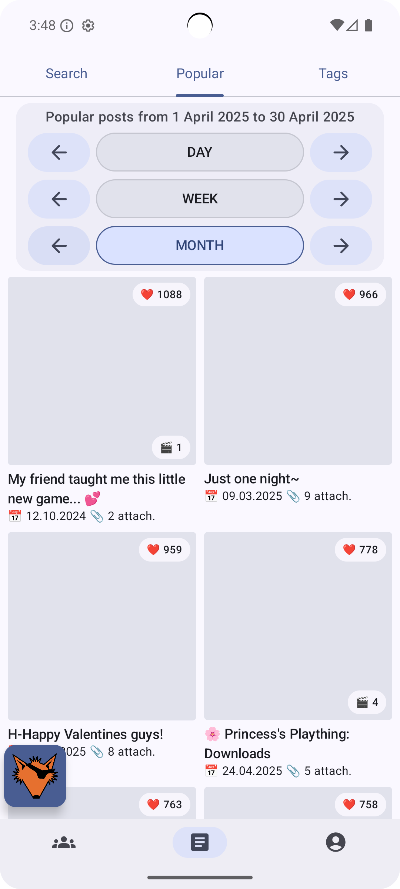
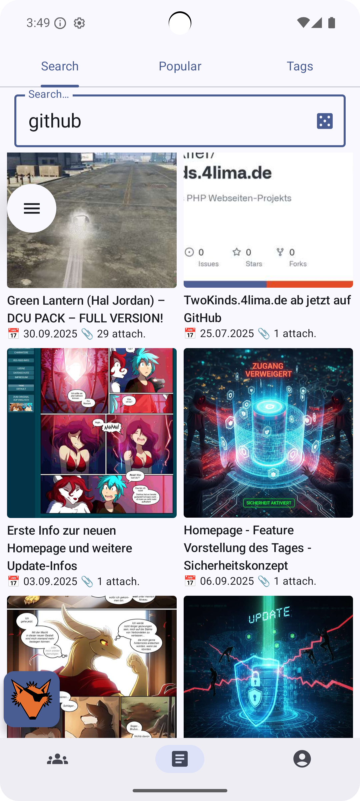
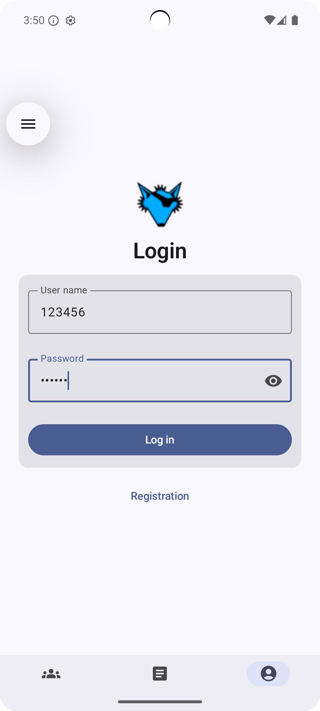
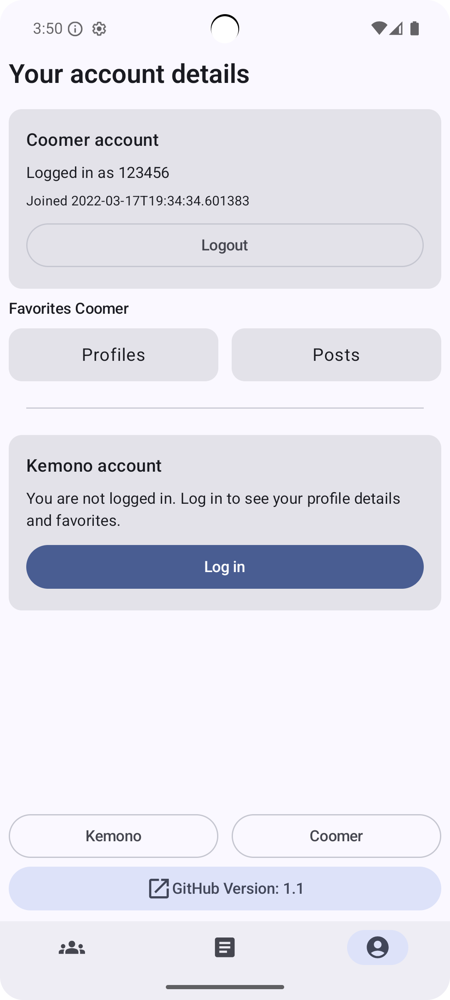

  

<h1 align="center">Kemonos</h1>

  Android client for <a href="https://kemono.cr/">kemono.cr</a> and <a href="https://coomer.st/">coomer.st</a> 
  Browse creators and posts with a clean UI and fast performance

  <strong>📱 Android • Kotlin • Jetpack Compose</strong>

  <a href="https://github.com/Helandy/Kemonos/releases">
    <strong>⬇️ Download latest version (Releases)</strong>
  </a>

---

## 📌 What is Kemonos?

**Kemonos** is an **unofficial Android client** for:

- Kemono site
- Coomer site

The app allows you to browse creators, posts, images and videos using a native Android UI instead of a web browser.

> ⚠️ This project is for **educational and personal use** only.  
> The app does not host any content and works only with publicly available data.

---

## ✨ Features

- 🔐 **Authentication** (Kemono / Coomer)
- 👤 **Creators browsing** (profiles, info, stats)
- 🧾 **Posts browsing** (feed + paging)
- 🏷️ **Tag search** (browse and filter by tags)
- 🔎 **Post search** (search posts by query)
- 🔥 **Popular posts** (trending / popular feed)
- 📅 **Popular by date** (sort/filter popular posts by date)
- ⭐ **Favorites**
    - favorite creators
    - favorite posts
- ❤️ **Like content** (posts / creators)
- 🔗 **Share content** (copy/share links for posts and profiles)
- 👀 **Post preview** (thumbnails/previews before opening)
- 🎬 **Video preview**
    - shows **duration**
    - shows **file size**
    - supports quick preview before playback

---

## 📱 Screenshots

  
  

  
  

---

## 📜 Disclaimer

- ❌ This app does **not** host any content
- ❌ This app does **not** bypass paywalls
- ✅ This app only displays publicly accessible data

All content belongs to its respective owners.

## ⭐ Support

If you find this project useful:

- ⭐ Star the repository
- 🐞 Report issues
- 💡 Suggest improvements
