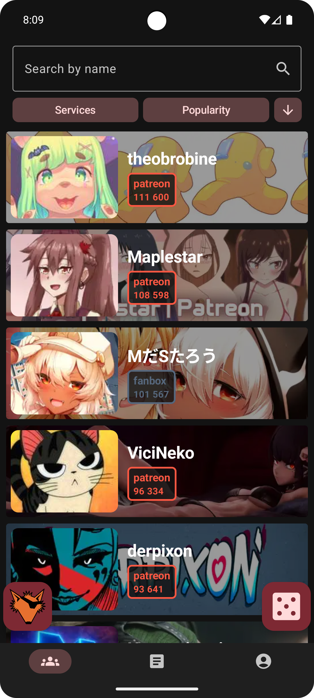
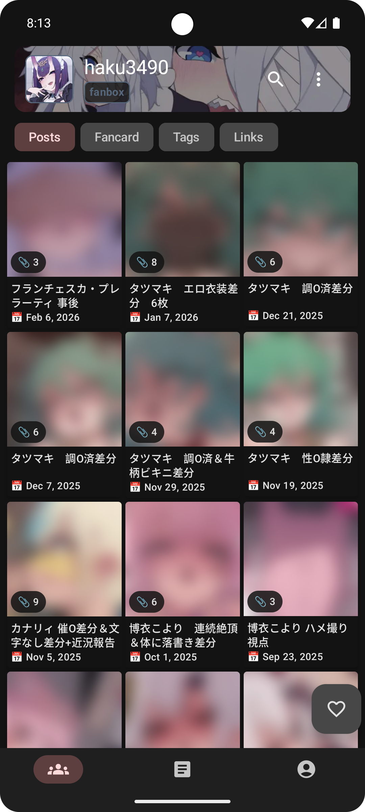
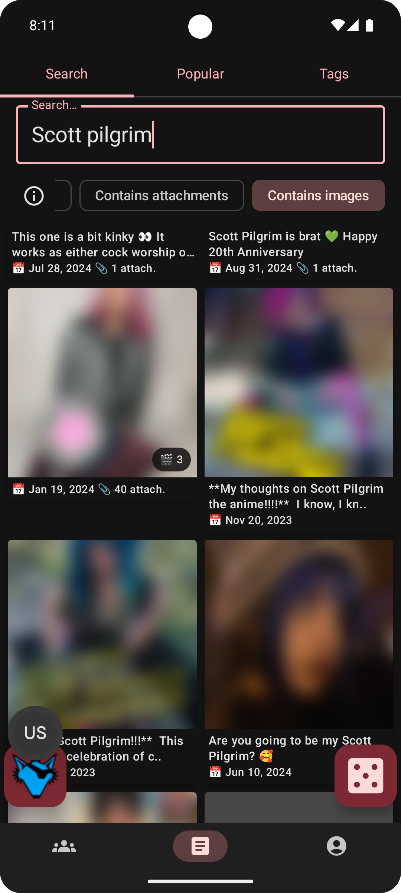
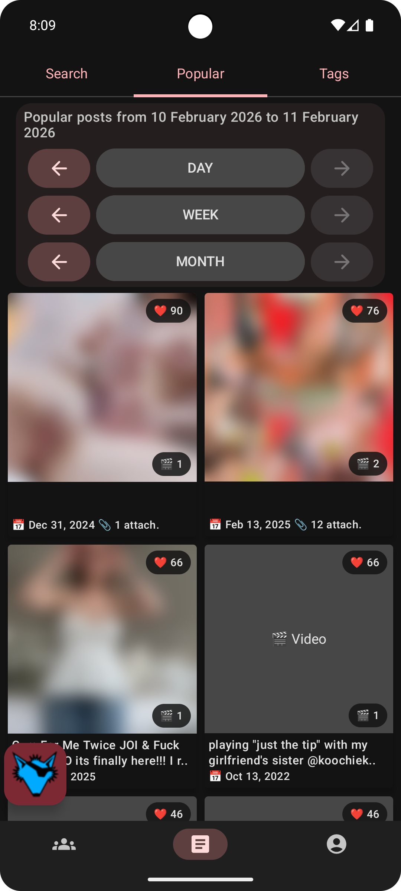
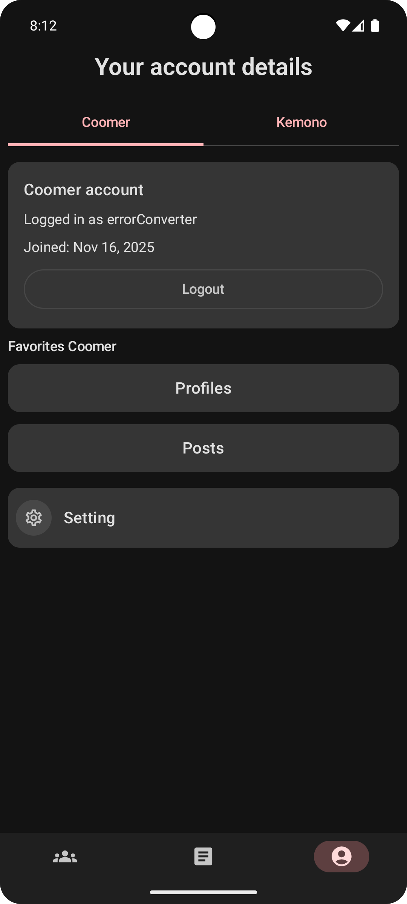

  

<h1 align="center">Kemonos</h1>

  Android client for <a href="https://kemono.cr/">kemono.cr</a> and <a href="https://coomer.st/">coomer.st</a> 
  Browse creators, posts, media, favorites, and search in a native app built with Kotlin + Jetpack Compose.

  
  
  

## Android app for Kemono and Coomer

Kemonos is an unofficial mobile app that helps you use Kemono/Coomer comfortably on Android:

- Faster navigation than a browser
- Better reading experience for posts and media
- Built-in search, filters, favorites, and profile tools
- Modern UI optimized for phones and tablets

Kemonos is focused on everyday mobile usage: quick browsing, comfortable reading, and fast access to creators and media.

## Features

- 🔐 Login support (Kemono / Coomer)
- 👤 Creator profiles with stats and tabs
- 🧾 Post feed with pagination
- 🏷️ Tag filters and navigation
- 🔎 Post search by query
- 🔥 Popular/trending feed with sorting
- ⭐ Favorites for creators
- ❤️ Favorites for posts
- 🔗 Quick actions: share/copy links
- 👀 Image previews before opening
- 🎬 Video previews with metadata
- ⚡ Smooth native Android UI

## Screenshots

  
  
  

  
  
  

## Download

Install the latest APK from [GitHub Releases](https://github.com/Helandy/Kemonos/releases).

## Disclaimer

- This is an unofficial client.
- The app does not host any content.
- The app does not bypass paywalls.
- All rights belong to their respective content owners.

## Support

- ⭐ Star the repository
- 🐞 Open an issue for bugs
- 💡 Suggest improvements via Discussions/Issues
