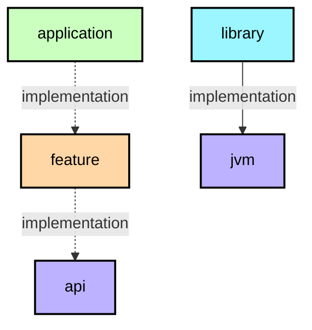

# Modularization learning journey

This document describes the modularization strategy used in Kemonos.
If you want theory first, use the official Android guidance on modularization:
[https://developer.android.com/topic/modularization](https://developer.android.com/topic/modularization).

**IMPORTANT:** Dependency direction matters more than module count. Keep feature boundaries clean and avoid accidental
coupling via `impl -> impl` links.

## Module types

```mermaid
graph TB
  subgraph core[":core"]
    direction TB
    core_auth["auth"]:::android-library
    core_deeplink["deepLink"]:::android-library
    core_domain["domain"]:::jvm-library
    core_navigation["navigation"]:::android-library
    core_network["network"]:::android-library
    core_preferences["preferences"]:::android-library
    core_utils["utils"]:::jvm-library
  end

  subgraph feature_api[":feature:* - api"]
    direction TB
    f_main_api["main-api"]:::jvm-library
    f_posts_api["posts-api"]:::jvm-library
    f_profile_api["profile-api"]:::jvm-library
    f_creatorprofile_api["creatorProfile-api"]:::jvm-library
    f_creatorpost_api["creatorPost-api"]:::jvm-library
    f_creators_api["creators-api"]:::jvm-library
    f_common_api["commonScreen-api"]:::jvm-library
    f_appupdate_api["appUpdate-api"]:::jvm-library
    f_download_api["download-api"]:::jvm-library
    f_videoplayer_api["videoPlayer-api"]:::jvm-library
  end

  subgraph feature_impl[":feature:* - impl"]
    direction TB
    f_main["main"]:::android-feature
    f_posts["posts"]:::android-feature
    f_profile["profile"]:::android-feature
    f_creatorprofile["creatorProfile"]:::android-feature
    f_creatorpost["creatorPost"]:::android-feature
    f_creators["creators"]:::android-feature
    f_common["commonScreen"]:::android-feature
    f_appupdate["appUpdate"]:::android-feature
    f_download["download"]:::android-feature
    f_videoplayer["videoPlayer"]:::android-feature
  end

  subgraph shared["Shared"]
    direction TB
    common["common"]:::android-library
    storage_api["storage-api"]:::android-library
    storage["storage"]:::android-feature
  end

  app["app"]:::android-application

  app -.-> f_main
  app -.-> f_posts
  app -.-> f_profile
  app -.-> f_creatorprofile
  app -.-> f_creatorpost
  app -.-> f_creators
  app -.-> f_common
  app -.-> f_appupdate
  app -.-> f_download
  app -.-> storage

  f_main -.-> f_main_api
  f_posts -.-> f_posts_api
  f_profile -.-> f_profile_api
  f_creatorprofile -.-> f_creatorprofile_api
  f_creatorpost -.-> f_creatorpost_api
  f_creators -.-> f_creators_api
  f_common -.-> f_common_api
  f_appupdate -.-> f_appupdate_api
  f_download -.-> f_download_api

  f_main -.-> storage_api
  f_posts -.-> storage_api
  f_profile -.-> storage_api
  f_creatorprofile -.-> storage_api
  f_creatorpost -.-> storage_api
  f_creators -.-> storage_api
  storage -.-> storage_api

  core_network -.-> core_auth
  core_network -.-> core_preferences
  core_network -.-> core_utils
  core_preferences -.-> core_auth
  core_preferences -.-> core_utils

  core_auth -.-> core_domain
  core_deeplink -.-> core_domain
  core_navigation -.-> core_domain
  core_network -.-> core_domain
  core_preferences -.-> core_domain
  core_utils -.-> core_domain

  storage_api -.-> core_domain
  f_main_api -.-> core_domain
  f_posts_api -.-> core_domain
  f_profile_api -.-> core_domain
  f_creatorprofile_api -.-> core_domain
  f_creatorpost_api -.-> core_domain
  f_creators_api -.-> core_domain
  f_common_api -.-> core_domain

  common -.-> core_navigation
  common -.-> core_network
  common -.-> core_preferences
  common -.-> storage_api

classDef android-application fill:#CAFFBF,stroke:#000,stroke-width:2px,color:#000;
classDef android-feature fill:#FFD6A5,stroke:#000,stroke-width:2px,color:#000;
classDef android-library fill:#9BF6FF,stroke:#000,stroke-width:2px,color:#000;
classDef jvm-library fill:#BDB2FF,stroke:#000,stroke-width:2px,color:#000;
```

📋 Graph legend

**Top tip:** keep all cross-feature navigation contracts in `feature:*:api` modules.

The Kemonos app contains the following types of modules:

### The `app` module

This module wires the application together: app lifecycle, root DI setup, and top-level navigation shell.  
Good examples: `MainActivity`, `App` (`KemonosApp.kt`), bottom bar and routing setup.

### Feature modules

Each feature is split into two Gradle modules:

- `api` contains contracts used by other modules (navigation keys, models, interfaces).
- `impl` (actual feature module without `-api` suffix) contains UI, ViewModels, repositories/use cases, and wiring.

Rules used in this project:

- `feature:*` (impl) can depend on `feature:*:api`, but should not depend on other feature impl modules.
- `feature:*:api` should stay lightweight and not depend on feature impl modules.
- Both can depend on required `core:*` modules.

### Core modules

Reusable cross-feature infrastructure:

- `:core:domain` and `:core:utils` are JVM-only foundations.
- Android core modules (`auth`, `network`, `preferences`, `navigation`, `deepLink`) provide platform-aware services.

Core modules should not depend on feature impl modules.

### Shared modules

- `:common` contains shared UI/components/helpers used by many features.
- `:storage-api` contains storage contracts.
- `:storage` contains storage implementation and database-related logic.

## Examples

| Name                     | Responsibilities                                                                          | Key classes and examples                                                                           |
|--------------------------|-------------------------------------------------------------------------------------------|----------------------------------------------------------------------------------------------------|
| `app`                    | App entrypoint, activity lifecycle, root-level navigation and composition of all modules. | `MainActivity`, `App` (`app/src/main/java/su/afk/kemonos/di/KemonosApp.kt`), `BottomNavigationBar` |
| `feature:posts-api`      | Public contracts for posts feature used by other modules.                                 | API contracts and models from `feature/posts-api`                                                  |
| `feature:posts`          | Posts screen logic: paging, repositories, ViewModels, navigation registration.            | `PostsPagerViewModel`, `PostsApi`, `PostsRepository`, `PostsPagerNavigator`                        |
| `feature:creatorProfile` | Creator profile flow: profile data, paging, related use cases.                            | `GetProfileUseCase`, `ProfileRepository`, `ProfilePostsPagingSource`                               |
| `core:network`           | Network stack, interceptors, base URL strategy, Hilt wiring.                              | `NetworkModule`, `ReplaceBaseUrlInterceptor`, `SwitchingBaseUrlProvider`                           |
| `core:preferences`       | Local preferences and URL/site settings use cases.                                        | `UrlPrefs`, `DomainResolver`, `SelectedSiteUseCase`                                                |
| `core:navigation`        | Navigation primitives and registrations shared by features.                               | `NavigationManager`, `NavRegistrar`, `AppNavHost`                                                  |
| `common`                 | Reusable UI and error/paging/image helpers.                                               | `ErrorHandlerUseCaseImpl`, `RetryStorage`, `AsyncImageWithStatus`                                  |
| `storage`                | Room entities/DAO/repositories and cache use cases.                                       | `ClearCacheStorageUseCase`, `VideoFrameCacheImpl`, `ProfileDao`                                    |

## Dependency graphs

Right now this repository has a single high-level technical graph in this file (`TECH_README.md`).
If needed, we can extend it with per-module README graphs (`app/README.md`, `feature/*/README.md`, etc.) and keep them
updated via CI.

## Further considerations

This structure is a practical balance: enough modularity for independent feature work, but without excessive
fragmentation.
As the app grows, likely next steps are:

1. Split very large feature impl modules by domain slices.
2. Move heavy shared logic out of `common` into narrower `core:*` modules.
3. Add automated dependency checks (forbidden edges like `feature impl -> feature impl`).
