# Kemonos: Technical Structure and Stack

This document describes the current module structure and the core technologies used in the project.

## Current Module Diagram

Source of truth: `settings.gradle.kts`.

```mermaid
graph TB
  app[":app"]:::app

  subgraph core[":core"]
    core_model[":core:model"]:::jvm
    core_utils[":core:utils"]:::jvm
    core_auth[":core:auth"]:::android
    core_network[":core:network"]:::android
    core_deepLink[":core:deepLink"]:::android
    core_preferences[":core:preferences"]:::android
    core_navigation[":core:navigation"]:::android
    core_ui[":core:ui"]:::android
    core_error[":core:error"]:::android
  end

  subgraph storage["Storage"]
    storage_api[":storage-api"]:::android
    storage_impl[":storage"]:::feature
  end

  subgraph feature_api[":feature:*:api"]
    api_common[":feature:commonScreen-api"]:::jvm
    api_creators[":feature:creators-api"]:::jvm
    api_creatorProfile[":feature:creatorProfile-api"]:::jvm
    api_creatorPost[":feature:creatorPost-api"]:::jvm
    api_posts[":feature:posts-api"]:::jvm
    api_profile[":feature:profile-api"]:::jvm
    api_appUpdate[":feature:appUpdate-api"]:::jvm
    api_download[":feature:download-api"]:::jvm
    api_main[":feature:main-api"]:::jvm
    api_videoPlayer[":feature:videoPlayer-api"]:::jvm
  end

  subgraph feature_impl[":feature:* (impl)"]
    f_common[":feature:commonScreen"]:::feature
    f_creators[":feature:creators"]:::feature
    f_creatorProfile[":feature:creatorProfile"]:::feature
    f_creatorPost[":feature:creatorPost"]:::feature
    f_posts[":feature:posts"]:::feature
    f_profile[":feature:profile"]:::feature
    f_appUpdate[":feature:appUpdate"]:::feature
    f_download[":feature:download"]:::feature
    f_main[":feature:main"]:::feature
    f_videoPlayer[":feature:videoPlayer"]:::feature
  end

  app --> core_auth
  app --> core_network
  app --> core_deepLink
  app --> core_preferences
  app --> core_navigation
  app --> core_ui
  app --> core_error
  app --> core_model
  app --> core_utils
  app --> storage_api
  app --> storage_impl

  app --> f_common
  app --> f_creators
  app --> f_creatorProfile
  app --> f_creatorPost
  app --> f_posts
  app --> f_profile
  app --> f_appUpdate
  app --> f_download
  app --> f_main

  f_common --> api_common
  f_creators --> api_creators
  f_creatorProfile --> api_creatorProfile
  f_creatorPost --> api_creatorPost
  f_posts --> api_posts
  f_profile --> api_profile
  f_appUpdate --> api_appUpdate
  f_download --> api_download
  f_main --> api_main
  f_videoPlayer --> api_videoPlayer

  storage_impl --> storage_api

  core_auth --> core_model
  core_network --> core_model
  core_deepLink --> core_model
  core_preferences --> core_model
  core_navigation --> core_model
  core_ui --> core_model
  core_error --> core_model
  core_utils --> core_model
  storage_api --> core_model

  classDef app fill:#CAFFBF,stroke:#000,stroke-width:2px,color:#000;
  classDef feature fill:#FFD6A5,stroke:#000,stroke-width:2px,color:#000;
  classDef android fill:#9BF6FF,stroke:#000,stroke-width:2px,color:#000;
  classDef jvm fill:#BDB2FF,stroke:#000,stroke-width:2px,color:#000;
```

## Module Types

- `:app` - Android application module, entry point, and root dependency composition.
- `:feature:*:api` - JVM modules with contracts (interfaces, models, navigation keys).
- `:feature:*` - Android feature implementation modules (UI, use-cases, wiring, DI).
- `:core:*` - reusable cross-feature infrastructure.
- `:storage-api` - API/contracts for the storage layer.
- `:storage` - storage implementation (Room, DataStore, cache, DAO, use-cases).

## Dependency Rules

- `feature impl -> feature api` is allowed.
- `feature impl -> feature impl` is not allowed.
- `feature api` must not depend on `feature impl`.
- `core` and `storage` must not depend on feature implementation modules.
- Shared application models are centralized in `:core:model`.

## Technologies

### Platform and Build

- Android Gradle Plugin `8.12.3`
- Gradle Version Catalog (`gradle/libs.versions.toml`)
- Kotlin `2.3.10`
- Java toolchain `21`
- KSP `2.3.4`
- Convention plugins in `build-logic` (including `kemonos.android.feature`)

### UI

- Jetpack Compose + Compose BOM `2026.02.00`
- Material 3
- Navigation 3 (`androidx.navigation3` + adaptive)
- Coil 3 (`coil-compose`, `gif`, `video`, `network-okhttp`)
- Accompanist System UI Controller
- Markdown renderer (`multiplatform-markdown-renderer-m3`)

### DI and Architecture Tooling

- Hilt (`com.google.dagger:hilt-android` + KSP compiler)
- AndroidX Hilt Navigation Compose
- Lifecycle (`runtime-compose`, `viewmodel-ktx`)

### Data and Storage

- Room (`runtime`, `ktx`, `paging`, compiler via KSP)
- DataStore Preferences
- Kotlin Serialization JSON
- Gson

### Networking and Parsing

- Retrofit 3
- OkHttp 5 (+ logging-interceptor)
- Jsoup
- RE2J

### Media and Integrations

- AndroidX Media3 (ExoPlayer + UI)
- Google Play Services Cast
- ML Kit Translate + Language ID

### Security

- AndroidX Security Crypto

### Testing and Debugging

- JUnit4
- AndroidX JUnit
- Espresso
- LeakCanary (debug)

## Module List (Current)

### App

- `:app`

### Core

- `:core:model`
- `:core:utils`
- `:core:auth`
- `:core:network`
- `:core:deepLink`
- `:core:preferences`
- `:core:navigation`
- `:core:ui`
- `:core:error`

### Storage

- `:storage-api`
- `:storage`

### Features

- `:feature:commonScreen-api`, `:feature:commonScreen`
- `:feature:creators-api`, `:feature:creators`
- `:feature:creatorProfile-api`, `:feature:creatorProfile`
- `:feature:creatorPost-api`, `:feature:creatorPost`
- `:feature:posts-api`, `:feature:posts`
- `:feature:profile-api`, `:feature:profile`
- `:feature:appUpdate-api`, `:feature:appUpdate`
- `:feature:download-api`, `:feature:download`
- `:feature:main-api`, `:feature:main`
- `:feature:videoPlayer-api`, `:feature:videoPlayer`

## Note

If `settings.gradle.kts` or the stack in `gradle/libs.versions.toml` changes, update this document in the same PR.
